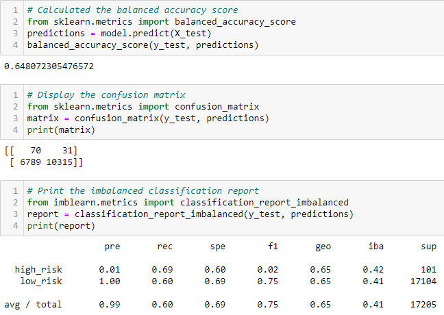
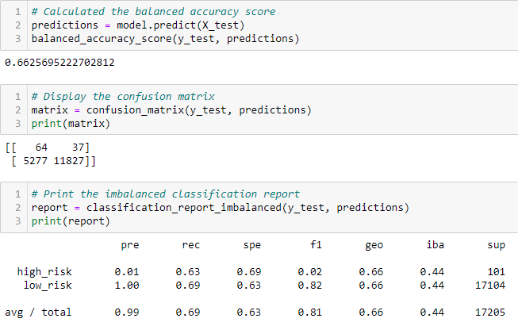
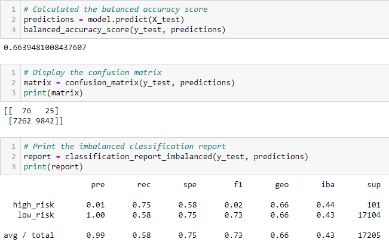
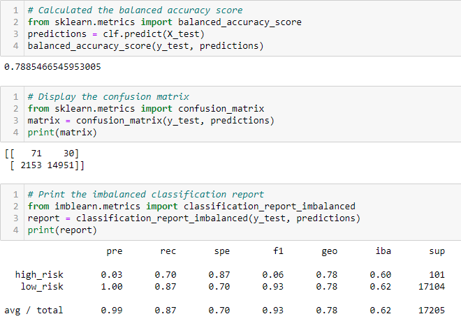

# Credit_Risk_Analysis

## Overview of the Analysis

We used a credit card dataset from LendingClub, a peer-to-peer lending services company, to test various algorithms and evaluate credit risk for a lender. We used Random Over Sampler, SMOTE, and Cluster Centroids, then used a combinatorial approach of over and undersampling using the SMOTEENN algorithm. We then compared two new machine learning models that reduce bias, Balanced Random Forest Classifier and Easy Ensemble Classifier. Once done, evaluate the performance of these models and make a written recommendation on whether they should be used to predict credit risk.

## Results

Quick summaries of all the different results:

### Random Over Sampler

- Balanced Accuracy Score: 0.648072305476572
- Precision: 0.99
- Recall: 0.60

### SMOTE

- Balanced Accuracy Score: 0.6625695222702812
- Precision: 0.99
- Recall: 0.69

### Cluster Centroids

- Balanced Accuracy Score: 0.5447339051023905
- Precision: 0.99
- Recall: 0.40

### SMOTEENN

- Balanced Accuracy Score: 0.6639481008437607
- Precision: 0.99
- Recall: 0.58

### Balanced Random Forest Classifier

- Balanced Accuracy Score: 0.7885466545953005
- Precision: 0.99
- Recall: 0.87

And here's a list of the top 10 important features based on the Random Forest Classifier:

### Easy Ensemble Classifier

- Balanced Accuracy Score: 0.9316600714093861
- Precision: 0.99
- Recall: 0.94

## Summary

All algorithms had a 99% precision, meaning almost all the positives were True Postives. On the other hand, the recall fluctuated a lot, going as low as 40%, meaning a lot of the positives were shown as negatives. The East Ensemble Classifier performed the best with a 93.17% Balanced Accuracy score along with and 94% recall, so almost no false positives and a relatively small amount of false negatives. However, as this data is supposed to be relevant for a lender so the most important number is the recall percentage for the High Risk people. We want as many High Risk people postively identified as possible and once we have that we can start looking at making sure we have as many customers as possible. 

So, I'd recommend using the East Ensemble Classifier to predict credit risk. In this case, not only does it have the best recall for the high-risk people but it also happens to have the best Balanced Accuracy Score as well.
